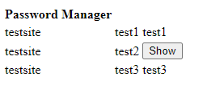
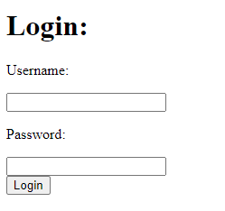
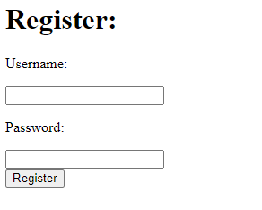

# PasswordManager
Just a small app to have fun with Blazor and give MySQL server with connector++ a try.
## Frontend
Web assembly using blazor on .net core 7. Basic HTML elements, no fancy CSS. All the data gets sent back to the Backend over WebSockets.
## Backend
C++ With connector++ And MySQL server. C++ server handles connection and database. Connector++ Communicates to the database. Uses PrepareStatement() to prevent MySQL injection attacks. 
## Images

  

  

  

